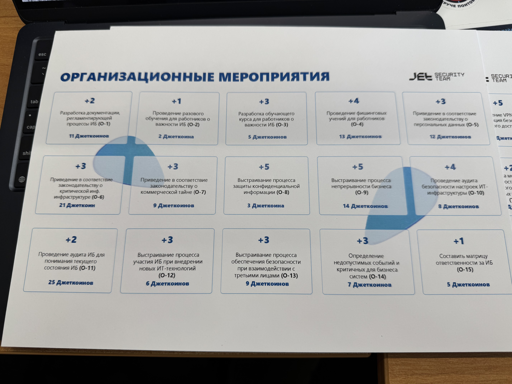

# Взаимодействие с организацией-партнером (отчеты)
**Срок окончания работы над задачей:** 23 апреля 2025 года.

## Мастер-класс: _"Инфосистемы Джет, "Выключите SOC, мы теряем деньги!"_

**Дата:** 23 апреля 2025 года.
**Время:** 16:00.

### Отчет

**Фото с мастер-класса:**

___

Мероприятие прошло в виде деловой игры, где участники выступали в роли CISO вымышленной компании. Согласно сценарию, они только начали работу в должности и должны были за 24 часа подготовить годовой план развития ИБ. Условия имитировали реальные вызовы: дефицит времени, ограниченный бюджет, необходимость выбора оптимальных решений для защиты инфраструктуры.

#### Полученные знания и опыт

В ходе мастер-класса участники:
- **Оценивали зрелость ИБ-системы:** изучали методы анализа текущего уровня защиты и идентификации ключевых угроз.
- **Определяли приоритеты мер по ИБ:** выбирали наиболее эффективные меры при ограниченных ресурсах (например, внедрение 2FA, аудит уязвимостей, обучение сотрудников).
- **Реальное применение фреймворков:** применяли NIST, MITRE ATT&CK для обоснования решений.
- **Коммуникация с руководством:** учились презентовать ИБ-стратегию через призму бизнес-целей.

Особый акцент сделан на критическом мышлении: участники доказывали целесообразность мер, избегая избыточных решений вроде необоснованного внедрения SOC.
Участникам нужно было доказать эффективность предложенных инициатив, исходя из конкретной бизнес-ситуации.

#### Связь с моей специальностью

Специальность «Информационная безопасность автоматизированных систем» напрямую связана с тематикой мастер-класса. Особенно полезным стал практический опыт оценки защищённости корпоративной инфраструктуры и выбор приоритетных направлений защиты автоматизированных систем. Такие навыки критически важны при проектировании и защите реальных ИТ-систем, в том числе в условиях ограниченных ресурсов — что является частым сценарием в реальной практике.

#### Связь с моим проектом

Мой текущий проект — **«Киберпольгон»** — направлен на создание интерактивной обучающей платформы с симуляцией кибератак. Полученные 
знания с мастер-класса могут быть использованы в проекте следующим образом:
- **Использование СПО для инфраструктуры** — Интеграция open-source решений (OSSEC для аудита, Grafana + Elastic Stack для визуализации данных) в учебные лаборатории. Это снизит затраты вузов на развёртывание полигона и обеспечит доступ к современным инструментам.
- **Актуализация контента** — Внедрение модулей по приоритизации ИБ-мер на основе анализа рисков.
- **Практика коммуникации с бизнесом** — Добавление симуляторов переговоров с «руководством», где пользователи учатся обосновывать ИБ-инициативы на языке бизнес-целей, преодолевая разрыв между теорией и индустриальными запросами.

#### Заключение

Мастер-класс дал ценный опыт в принятии управленческих решений в области ИБ в условиях ограниченных ресурсов. Он усилил навыки стратегического планирования в ИБ. Полученные
знания дополнили мои профессиональные компетенции как специалиста в области ИБ автоматизированных систем и могут быть 
успешно интегрированы в мой проект Киберполигон.

