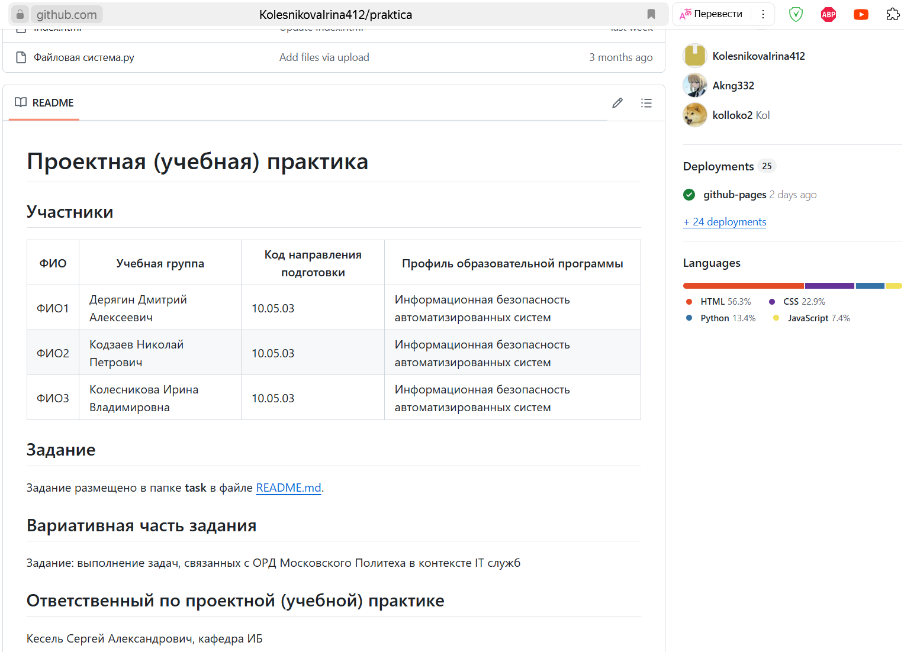

# Настройка git и репозитория
**Срок окончания работы над задачей:** 23 апреля 2025 года.

## Создание репозитория
Основной репозиторий был создан вручную без использования команды git clone в соответствии с шаблоном-репозиторием
[practice-2025-1](https://github.com/mospol/practice-2025-1). Для этого:
- Создана структура папок и файлов в соответствии с шаблоном;
- Текстовое содержимое скопировано из образца в соответствующие файлы и отредактировано в соответствии с заданием.
  

## Работа в среде CLion
Для разработки использовалась IDE CLion, поскольку встроенные инструменты Git упростили визуализацию изменений, коммитов и управление ветками.

Через интерфейс IDE были выполнены ключевые действия:
- Добавление файлов в отслеживаемые (git add).
- Создание коммитов с комментариями (git commit).

## Заполнение репозитория
После этого, в тот же день, была завершена работа над заполнением  и редактированием основных README.md файлов в репозитории.

**Это отражено в следующих коммитах:**
- [index код готового сайта](https://github.com/KolesnikovaIrina412/praktica/commit/a26d2fdc023d9404ba1d643017834fb096e32fac);
- [css код готового сайта](https://github.com/KolesnikovaIrina412/praktica/commit/7e70d4d80131e61226a4eeabd9f822ba96ba4bdc);
- [java код готового сайта](https://github.com/KolesnikovaIrina412/praktica/commit/038c0fb3e2267e8be0f94500d8d3bbc697a9ee11);
- [ссылка на сайт](https://github.com/KolesnikovaIrina412/praktica/commit/ebb3f23ad2e3b07aa253a49c57441b3d13a924e7);
- [Заполнение README](https://github.com/KolesnikovaIrina412/praktica/commit/23841f4624e9388e32640e946146f21e6d19472c);
