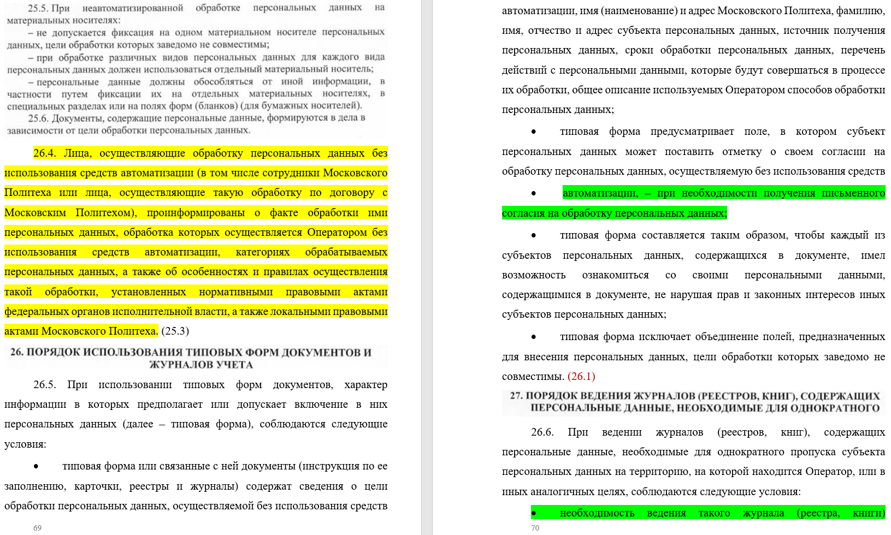

# Отчет по индивидуальному кафедральному заданию
**Формулировка:** "Выполнение задач, связанных с ОРД Московского Политеха в контексте IT служб"

**Задачи:**

- Ознакомление с внутренними нормативно-правовыми актами Московского политеха по информационной безопасности;
- Формирование листов ознакомления с «Регламентом безопасной работы в информационных системах Московского Политеха» для каждого подразделения с использованием автоматизации;
- Анализ законодательства РФ в области информационной безопасности;
- Изучение топологии сети университета и построение её схемы;
- Ознакомление сотрудников филиала «на Большой Семёновской» с «Регламентом безопасной работы в информационных системах Московского Политеха» под роспись;
- Переформатирование Положения об обработке и защите персональных данных в ФГАОУ ВО «Московский политехнический университет» от «01» сентября 2016г. в формат .docx для дальнейшего редактирования;
- Объединение, редактирование и актуализация упомянутых выше документов;
- Создание Положения в отношении обработки ПДн от 2025г. на основе изученных документов, оформление и редактирование нового документа.

---

## Ход работы:

### 1. Формирование листов ознакомления

- Создан унифицированный шаблон листа ознакомления;
- Реализована автоматизация распределения документов по подразделениям с помощью Python-скрипта.
  
### 2. Анализ законодательства РФ в области ИБ

- Были проанализированы: ФЗ-149 "Об информации, информационных технологиях и о защите информации", ФЗ-187 "О безопасности критической информационной инфраструктуры Российской Федерации", ФЗ-152 "О персональных данных", Приказ ФСТЭК №17.
  
### 3. Изучение топологии сети университета и построение её схемы

- Была составлена актуальная схема топологии корпоративной сети.
  
### 4. Ознакомление сотрудников с Регламентом

- Предоставляли руководителям подразделений лист ознакомления с Регламентом безопасной работы в информационных системах Московского Политеха;
- Проведены консультации для руководителей подразделений по вопросам безопасной работы с ИС.

### 5. Создание актуального положения об обработке и защите персональных данных для ФГАОУ ВО «Московский политехнический университет»

#### 5.1. Изучение и переформатирование положения об обработке и защите персональных данных

- Перед началом работы были изучены ФЗ-152 "О персональных данных", Приказ ФСТЭК №21, Постановление Правительства РФ №1119;
- Изучено положения об обработке и защите персональных данных в ФГАОУ ВО «Московский политехнический университет» от «01» сентября 2016г;
- Изучено положения об обработке и защите персональных данных в Чебоксарском институте (филиале) федерального государственного бюджетного образовательного учреждения высшего образования «Московский политехнический университет» от «29» августа 2018г.;
- Проведено сравнение используемых на данный момент документов;
- Переформатировано положения Чебоксарского института (филиала) в формат .docx для дальнейшего редактирования;

  

#### 5.2. Актуализация положения об обработке и защите персональных данных

- Переформатированное положение было отредактировано;
- После форматирования был проведен тщательный анализ положения с последующей актуализацией;
- Редактирование и согласование;

#### 5.3. Финальный просмотр документа

- Была проведена финальная проверка документа на ошибки и недочеты;
- В завершении получаем проверенное и актуализированное "Положение в отношении обработки персональных данных" от 2025 года, готовое к внедрению.

Отредактированный документ: [Положение_в_отношении_обработки_ПДн.pdf](https://github.com/user-attachments/files/20236963/_._._._.pdf)

---

## Итог

В ходе выполнения работы команда успешно выполнение задачи, связанные с организационно-распорядительными документами Московского Политеха в контексте IT служб. 
**Ключевые результаты:**

- Изучены локальные акты и положения университета;
- Изучены федеральные законы (ФЗ-149, ФЗ-152, ФЗ-187, Приказ ФСТЭК №21);
- Изучены требования регуляторов (ФСТЭК, Правительство РФ) в области защиты персональных данных;
- Внедрена специализированная система ознакомления сотрудников о внутренних регламентах;
- Актуализирована схема сетевой инфраструктуры;
- Разработано новое Положение об обработке персональных данных, соответствующее требованиям 2025 года.

---
