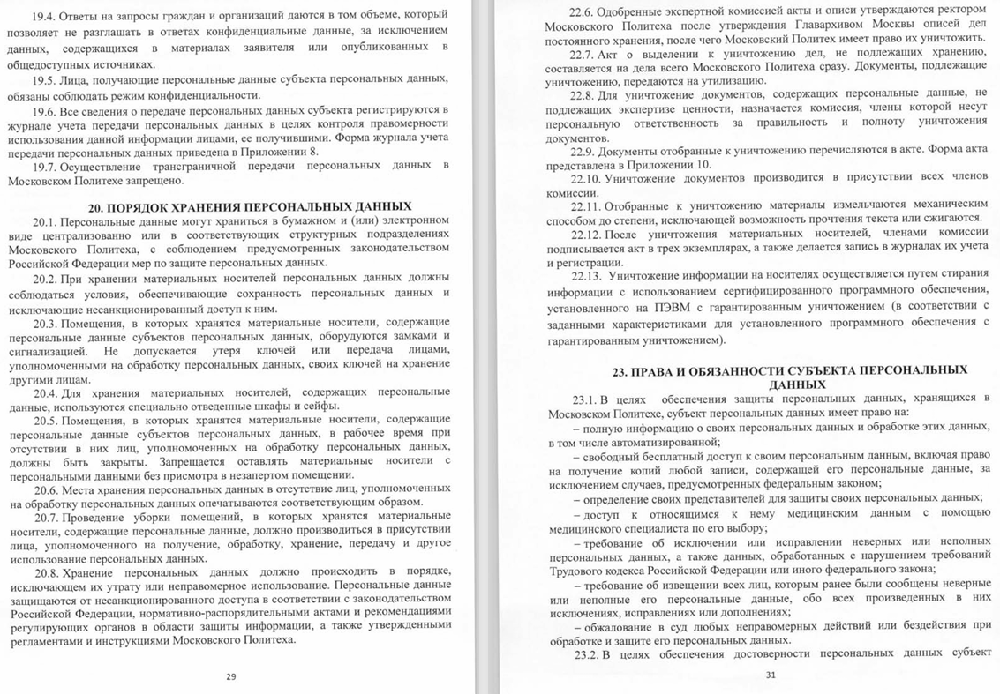
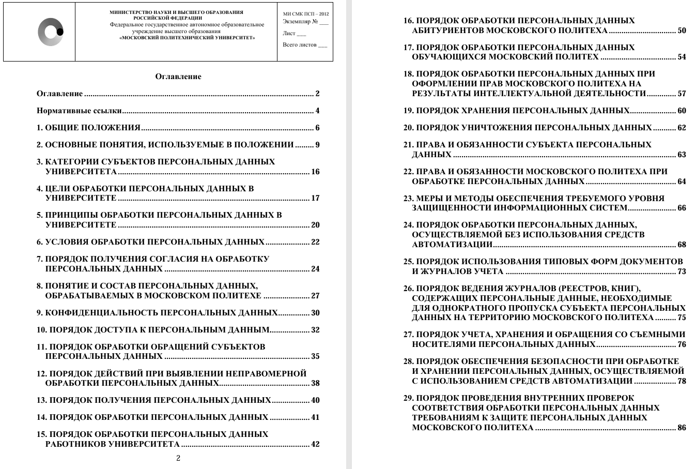
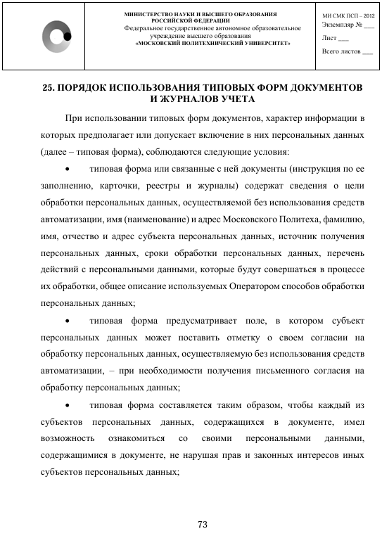

# Отчет по индивидуальному кафедральному заданию
(Дима, это на твоей совести)
**Формулировка:** "Выполнение задач, связанных с ОРД Московского Политеха в контексте IT служб"

**Задачи:**
> - Организационные методы защиты информации;
> - Ознакомление с Регламентом безопасной работы пользователей;

---

## Оборудование и ПО

- **Хостовая ОС**: macOS Sequoia
- **Гостевая ОС (VM)**: Windows 11 Pro
- **Система мониторинга**: Graylog 6.x _(в Docker)_
- **Агент логирования**: Winlogbeat 8.x
- **Инструменты**: Docker, PowerShell, Telegram, Event Viewer

---

## Ход работы

### 1. Перевод документ в текстовый формат

Через `secpol.msc` включены политики:

- Аудит входа в систему (успешный и неуспешный)
- Аудит использования привилегий
- Аудит создания/удаления пользователей
- Аудит изменений политик безопасности

> Это обеспечило генерацию событий: 4624, 4625, 4672, 4720, 4719.

---

### 2. Редактирование текста

**Graylog** развёрнут в **Docker** (с MongoDB и Elasticsearch), открыт порт 5044 для Beats. Использован 
**docker-compose**, что упростило управление сервисами.

---

### 3. Актуализация информации в документе

На виртуальной Windows:

- Установлен **Winlogbeat**
- Настроен `winlogbeat.yml` (output → логстэш на хосте)
- Установлен как сервис
- Запущен

---

### 4. Финальный просмотр документа

Для каждого события был создан отдельный stream (для дальней реализации автоматических уведомлений в **telegram** через
**alert-ы**).

---

## Итог
(напиши, какие мы молодци, чему научились и т.п)

Отредактированный документ: 
