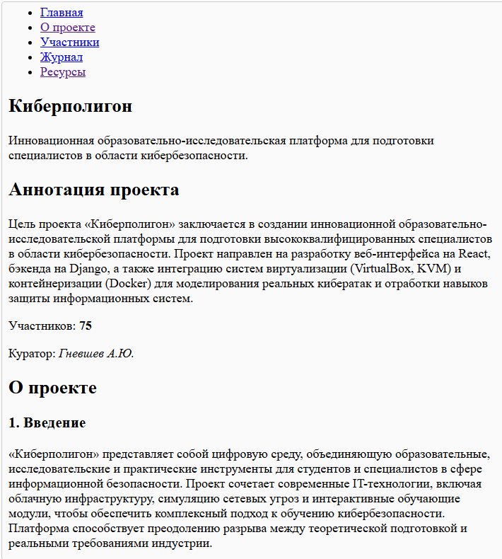
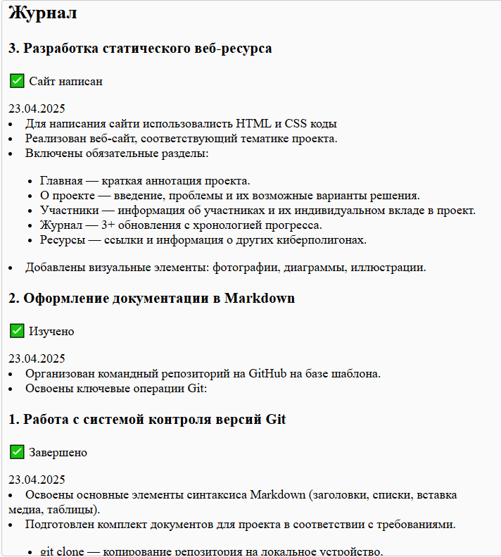
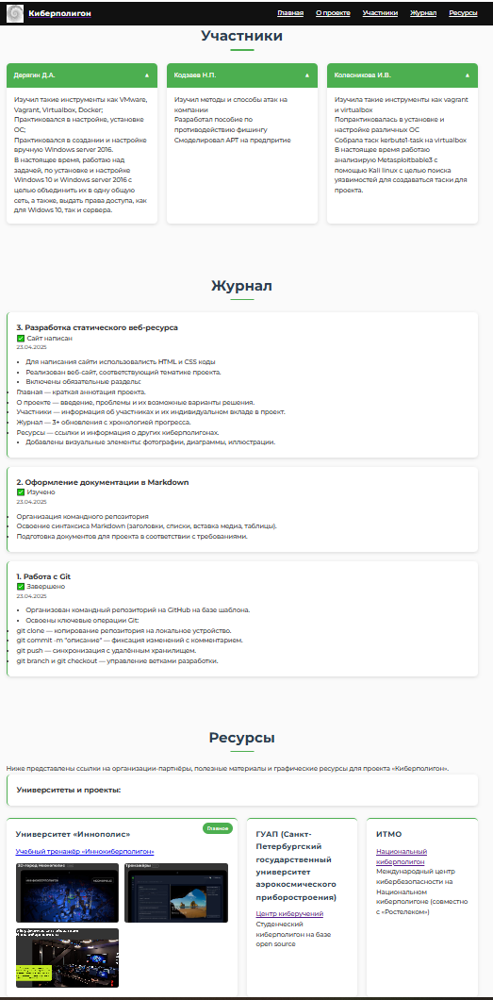

# Создание статического веб-сайта
**Срок окончания работы над задачей:** 7 мая 2025 года.

## Выбор технологии для основы веб-сайта
Поскольку нам требовалось сделать одностраничный сайт без сложных систем, было принято решение просто написать
сайт используя html + css для создания дизайна сайта, позднее мы добавили js скрипт который улучшал дизайн
путем добавления красивой прокрутки на сайт.

После изучения документации, через некоторое время была создана черновая версия сайта с основными разделами из описания 
задачи.

**В итоге**, за 23 апреля были написаны HTML и CSS коды и создана черновая версия сайта.

- .
- .

## Заполнение сайта информацией по проекту
В течение 23 апреля сайт был заполнен всей необходимой информацией по проекту, **включая**:
- **Аннотация** на главной странице (описание проекта, цель, актуальность);
- **Страница "О проекте"** (задачи, проблемы, образовательные модули, взаимодействие с партнерами);
- **Страница с участниками** (ФИО и достижения на ПД);
- **Журнал** (сделаны отдельные окна под кажую выполненую задачу на практике);
- **Дополнительные материалы** на странице "Ресурсы" (ссылки на полезные ресурсы);

**Это отражено в следующих коммитах:**
- [Добавление медиа](https://github.com/KolesnikovaIrina412/praktica/commit/3444e6b1500bc0f568af92d921a36cad673993f2);
- [Добавление статей и разделов на сайт]https://github.com/KolesnikovaIrina412/praktica/commit/a26d2fdc023d9404ba1d643017834fb096e32fac);

## Создание итоговой версии сайта
Коля,про это пишешь ты
 
**Это отражено в следующих коммитах:**
- [Обновление index файла](https://github.com/KolesnikovaIrina412/praktica/commit/a26d2fdc023d9404ba1d643017834fb096e32fac);
- [Обновление css файла](https://github.com/KolesnikovaIrina412/praktica/commit/7e70d4d80131e61226a4eeabd9f822ba96ba4bdc);
- [Добвление js файла](https://github.com/KolesnikovaIrina412/praktica/commit/038c0fb3e2267e8be0f94500d8d3bbc697a9ee11);

## Публикация сайта на (?)
В течение 7 мая была собрана итоговая версия сайта и загружена в папку site, в итоге сайт 
выложен в сеть.

- .
- .
  
**Это отражено в следующем коммите:**
- [site](https://github.com/KolesnikovaIrina412/praktica/commit/ebb3f23ad2e3b07aa253a49c57441b3d13a924e7);
